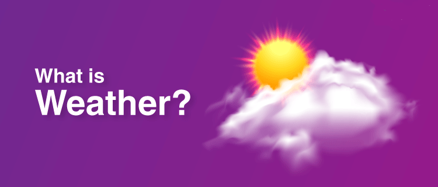

# Weather App

**This is a simple Weather application built with Node.js, It provides weather information for a given address location. It utilizes the [Visual Crossing Web Services API](https://www.visualcrossing.com) to fetch weather data based on user input, through a command-line interface.**



---

### Features:

- Fetches weather data for a specified location.
- Displays weather conditions, including temperature, humidity, wind speed, and more.
- Search for weather information based on a city, address, or coordinates.

---

### Installation:

1. Make sure you have [Node.js](https://nodejs.org/) installed on your machine.
2. Clone this repository or download the source code.
3. Open your terminal or command prompt and navigate to the project directory.
4. Run the following command to install the required dependencies:

   ```sh
   npm install
   ```

---

### API Key Configuration:

Before using the Weather App CLI, you need to obtain an API key from Visual Crossing. Follow these steps:

- Visit the [Visual Crossing website](https://www.visualcrossing.com/weather-data-editions).
- Sign up for a free account or log in to your existing account.
- Navigate to the "Account" section and copy your API key.

Once you have obtained the API key, open the [geocode.js](./geocode.js) file and replace the placeholder API key with your actual API key:

---

### Usage:

1. Open your terminal or command prompt and navigate to the project directory.
2. Run this command for help:
   ```sh
   node app.js --help
   ```
3. You can now run this command:

   ```sh
   node app.js --address="New York City"
   ```

   Replace "New York City" with the desired location you want to fetch weather information for. You can specify a city, address, or coordinates

   ***

### Contributing:

If you have any suggestions, improvements, or bug fixes, please submit a pull request. Ensure that your code follows the existing code style and includes appropriate comments. Your contributions are greatly appreciated!

---

### Contact:

If you have any questions or issues regarding this project, please feel free to contact me at [Twitter](https://twitter.com/ezeibekweemma) | [LinkedIn](https://linkedin.com/in/ezeibekweemma).
